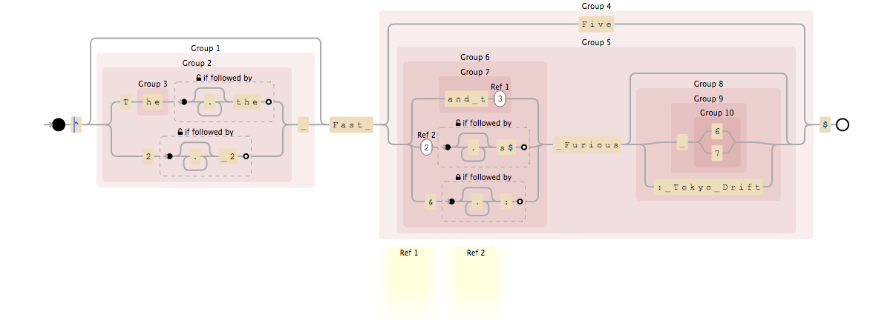

# RFastRFurious

easily validate movie titles from the fast and the furious saga

## Installation

Add this line to your application's Gemfile:

    gem 'r_fast_r_furious'

And then execute:

    $ bundle

Or install it yourself as:

    $ gem install r_fast_r_furious

## Usage

    require "r_fast_r_furious"
    RFastRFurious.check("Fast Five") # => true
    RFastRFurious.check("The Sorrow and the Pity") # => false

## The Awesome Regex Explained

## Contributing

1. Fork it
2. Create your feature branch (`git checkout -b my-new-feature`)
3. Commit your changes (`git commit -am 'Add some feature'`)
4. Push to the branch (`git push origin my-new-feature`)
5. Create new Pull Request
